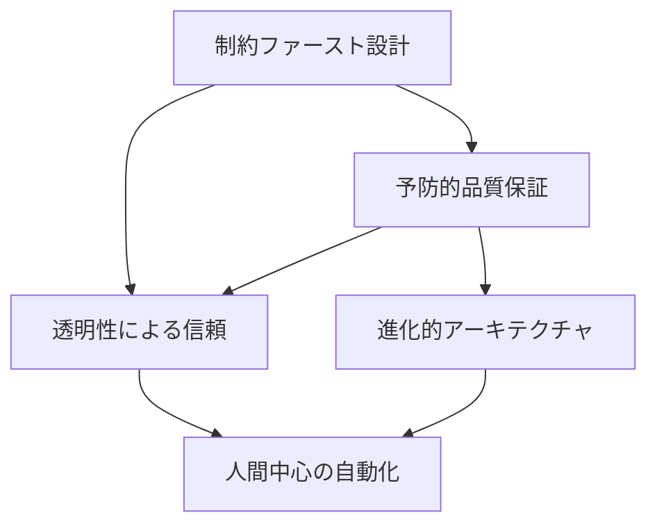

# 📐 MIRRALISM Design Principles v1.0
## 全チーム共有設計ガイドライン

**バージョン**: 1.0.0  
**発効日**: 2025年6月7日  
**承認者**: MIRRALISM CTO  
**目的**: V1を超越する品質基準の確立と全チーム統一

---

## 🎯 **核心理念**

> "便宜性の誘惑を排し、本質的品質を追求する"

MIRRALISMは、短期的な便宜性や効率性の誘惑に負けることなく、長期的な品質と持続可能性を追求します。

---

## 🏛️ **基本原則体系**

### **原則1: 制約ファースト設計 (Constraint-First Design)**

#### 定義
```yaml
概要: 制約を設計の出発点とし、品質を構造的に保証する
スローガン: "制約は創造性の母"
```

#### 適用範囲
- **必須適用**: セキュリティ、データ整合性、パフォーマンス要件
- **推奨適用**: UI/UX設計、API設計、アーキテクチャ決定
- **検討適用**: 機能追加、リファクタリング

#### 実装指針
```yaml
1. 制約の明確化:
   - ビジネス制約の文書化
   - 技術制約の定量化
   - リソース制約の可視化

2. 制約の優先順位:
   - セキュリティ > データ整合性 > パフォーマンス > 利便性

3. 制約の検証:
   - 自動テストによる継続的検証
   - 定期的な制約レビュー
   - 違反の即座検出
```

### **原則2: 予防的品質保証 (Preventive Quality Assurance)**

#### 定義
```yaml
概要: 問題が発生する前に検出し、自動的に防止する
スローガン: "予防は治療に勝る"
```

#### 適用範囲
- **必須適用**: エラーハンドリング、セキュリティ、データ品質
- **推奨適用**: パフォーマンス、ユーザビリティ、コード品質
- **検討適用**: 新機能開発、実験的機能

#### 実装指針
```yaml
1. 監視システムの構築:
   - リアルタイム監視
   - 異常パターンの学習
   - 予測的アラート

2. 自動防御メカニズム:
   - 自己修復機能
   - フェイルセーフ設計
   - グレースフルデグラデーション

3. 継続的改善:
   - インシデントからの学習
   - 予防策の自動更新
   - 効果測定とフィードバック
```

### **原則3: 進化的アーキテクチャ (Evolutionary Architecture)**

#### 定義
```yaml
概要: 変化を前提とし、適応可能な設計を維持する
スローガン: "唯一の定数は変化である"
```

#### 適用範囲
- **必須適用**: システムアーキテクチャ、API設計、データモデル
- **推奨適用**: UI/UXフレームワーク、インフラストラクチャ
- **検討適用**: 外部連携、サードパーティ統合

#### 実装指針
```yaml
1. 疎結合設計:
   - マイクロサービス志向
   - イベント駆動アーキテクチャ
   - 依存性の最小化

2. 抽象化レイヤー:
   - インターフェース定義
   - アダプターパターン
   - ファサードパターン

3. 段階的移行:
   - カナリアデプロイ
   - フィーチャーフラグ
   - 後方互換性維持
```

### **原則4: 透明性による信頼 (Trust through Transparency)**

#### 定義
```yaml
概要: システムの状態と決定を可視化し、信頼を構築する
スローガン: "見えるものは制御できる"
```

#### 適用範囲
- **必須適用**: システム状態、エラー情報、監査ログ
- **推奨適用**: パフォーマンスメトリクス、ビジネスメトリクス
- **検討適用**: 開発プロセス、意思決定記録

#### 実装指針
```yaml
1. 可観測性の確保:
   - 包括的なロギング
   - 分散トレーシング
   - メトリクス収集

2. ダッシュボード化:
   - リアルタイムビュー
   - 履歴トレンド分析
   - アラート統合

3. ステークホルダー共有:
   - 役割別ビュー
   - 定期レポート
   - インシデント報告
```

### **原則5: 人間中心の自動化 (Human-Centric Automation)**

#### 定義
```yaml
概要: 自動化は人間を置き換えるのではなく、増幅する
スローガン: "機械は手段、人間は目的"
```

#### 適用範囲
- **必須適用**: デプロイメント、テスト、監視
- **推奨適用**: コード生成、ドキュメント生成、レポート作成
- **検討適用**: 意思決定支援、創造的タスク

#### 実装指針
```yaml
1. 人間の判断尊重:
   - 重要決定の人間確認
   - オーバーライド機能
   - 説明可能なAI

2. 認知負荷軽減:
   - 複雑性の隠蔽
   - 直感的インターフェース
   - コンテキスト保持

3. スキル向上支援:
   - 学習機会の提供
   - フィードバックループ
   - 知識共有促進
```

---

## 🔗 **原則間の関係性**

### **依存関係マトリクス**


### **優先順位**
1. **制約ファースト設計** - 全ての基盤
2. **予防的品質保証** - 品質の守護者
3. **透明性による信頼** - 運用の要
4. **進化的アーキテクチャ** - 持続性の保証
5. **人間中心の自動化** - 価値の増幅器

---

## 📋 **実装チェックリスト**

### **新機能開発時**
- [ ] 制約を明確に定義したか？
- [ ] 予防的品質保証メカニズムを組み込んだか？
- [ ] 将来の変更に対応できる設計か？
- [ ] システム状態は透明に可視化されているか？
- [ ] 人間のワークフローを考慮したか？

### **コードレビュー時**
- [ ] MIRRALISM原則に準拠しているか？
- [ ] V1の問題パターンを繰り返していないか？
- [ ] 長期的な保守性を考慮しているか？
- [ ] 適切な抽象化レベルか？
- [ ] ドキュメントは十分か？

### **リリース前**
- [ ] 全ての制約が満たされているか？
- [ ] 監視・アラートは設定されているか？
- [ ] ロールバック計画は準備されているか？
- [ ] ステークホルダーへの通知は完了しているか？
- [ ] 運用手順書は更新されているか？

---

## 🚀 **適用開始ガイド**

### **Phase 1: 認識共有（1週間）**
- 全チームメンバーへの説明会実施
- Q&Aセッション開催
- 実例を用いたワークショップ

### **Phase 2: パイロット適用（2週間）**
- 小規模プロジェクトでの試験適用
- フィードバック収集
- ガイドライン調整

### **Phase 3: 全面展開（1ヶ月）**
- 全プロジェクトへの適用
- 定期的なレビュー会
- 継続的改善プロセス確立

---

## 📚 **参考資料**

### **推奨書籍**
- "Building Evolutionary Architectures" - Neal Ford
- "Site Reliability Engineering" - Google
- "The Phoenix Project" - Gene Kim

### **内部ドキュメント**
- V1技術的負債完全マップ
- MIRRALISM Security Framework
- 評価システム設計書

---

## 🔄 **改訂履歴**

| バージョン | 日付 | 変更内容 | 承認者 |
|-----------|------|----------|--------|
| 1.0.0 | 2025-06-07 | 初版作成 | CTO |

---

**"品質は偶然ではなく、設計によって生まれる" - MIRRALISM Design Principles v1.0**