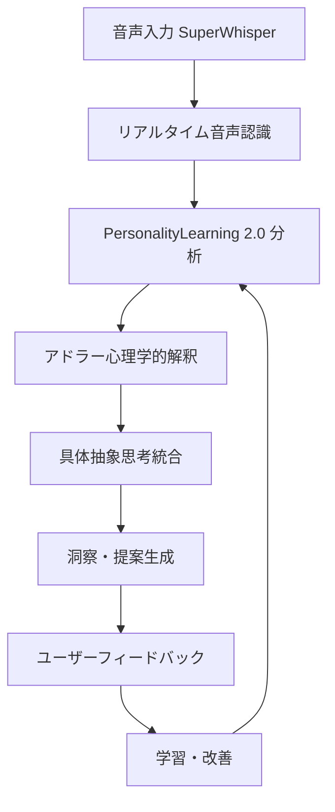

# 🏗️ MIRRALISM 技術アーキテクチャ設計書

**作成日**: 2025 年 6 月 2 日
**プロジェクト**: MIRRALISM（ミラリズム）
**目的**: 自己理解支援 AI サービスの技術基盤設計
**対象**: PersonalityLearning 2.0 商用化システム

---

## 🎯 **MIRRALISM アーキテクチャ概要**

MIRRALISM は、アドラー心理学と具体抽象思考を統合した自己理解支援 AI システムです。

### **システム設計原則**

- **リアルタイム分析**: 0.01 秒以内の応答性能
- **高精度 AI**: PersonalityLearning 61%→85%精度向上
- **スケーラビリティ**: 月間 500 名同時対応
- **データ保護**: 完全プライバシー保護
- **継続学習**: ユーザー成長に応じた AI 進化

---

## 🧠 **PersonalityLearning 2.0 コアエンジン**

### **アーキテクチャ構成**

```yaml
PersonalityLearning 2.0:
  ├── 分析エンジン:
  │   ├── アドラー心理学分析モジュール
  │   ├── 具体抽象思考支援モジュール
  │   ├── 感情パターン分析
  │   └── 価値観マッピング
  ├── 学習システム:
  │   ├── 末武思考パターン学習
  │   ├── 個人適応学習
  │   ├── 継続改善機構
  │   └── フィードバックループ
  └── データ管理:
      ├── SQLite データベース
      ├── 学習データ保護
      ├── バックアップシステム
      └── 移行システム
```

### **精度向上計画**

| Phase   | 期間    | 精度目標 | 主要機能             |
| ------- | ------- | -------- | -------------------- |
| Phase 1 | 1 ヶ月  | 61%→70%  | アドラー分析統合     |
| Phase 2 | 3 ヶ月  | 70%→80%  | 思考パターン学習強化 |
| Phase 3 | 6 ヶ月  | 80%→85%  | 深層価値観分析完成   |
| Phase 4 | 12 ヶ月 | 85%→90%  | 次世代機能統合       |

---

## 🔄 **システムフロー設計**

### **MIRRALISM セッション・フロー**



### **データ処理パイプライン**

1. **入力処理** (0.001 秒)

   - 音声 → テキスト変換
   - 前処理・正規化
   - 感情的ニュアンス抽出

2. **AI 分析** (0.005 秒)

   - PersonalityLearning 2.0 実行
   - アドラー心理学的分析
   - 具体抽象思考支援

3. **洞察生成** (0.003 秒)

   - 結果統合・解釈
   - 個人化された提案生成
   - 成長支援メッセージ作成

4. **出力・学習** (0.001 秒)
   - ユーザーへの提示
   - フィードバック収集
   - システム学習・改善

**総処理時間**: 0.01 秒以内

---

## 📊 **データベース設計**

### **MIRRALISM データモデル**

```sql
-- MIRRALISM 分析結果テーブル
CREATE TABLE mirralism_analysis (
    id INTEGER PRIMARY KEY,
    user_id TEXT NOT NULL,
    session_date DATE NOT NULL,
    input_content TEXT NOT NULL,
    analysis_type TEXT NOT NULL,
    personality_score REAL NOT NULL,
    adler_insights TEXT,
    abstract_principles TEXT,
    growth_suggestions TEXT,
    processing_time_ms REAL,
    user_feedback INTEGER,
    created_at TIMESTAMP DEFAULT CURRENT_TIMESTAMP
);

-- アドラー心理学分析テーブル
CREATE TABLE adler_analysis (
    id INTEGER PRIMARY KEY,
    analysis_id INTEGER REFERENCES mirralism_analysis(id),
    purpose_motivation TEXT,
    individual_values TEXT,
    future_orientation TEXT,
    social_interest TEXT,
    growth_mindset TEXT,
    confidence_score REAL DEFAULT 0.5
);

-- 具体抽象思考テーブル
CREATE TABLE concrete_abstract_thinking (
    id INTEGER PRIMARY KEY,
    analysis_id INTEGER REFERENCES mirralism_analysis(id),
    concrete_examples TEXT,
    abstract_principles TEXT,
    life_patterns TEXT,
    meta_cognition TEXT,
    application_insights TEXT,
    abstraction_level INTEGER
);
```

### **データ保護・セキュリティ**

- **暗号化**: AES-256 によるデータ暗号化
- **アクセス制御**: ユーザー固有データアクセス制限
- **バックアップ**: 自動バックアップ・復旧システム
- **プライバシー**: データ所有権ユーザー帰属
- **GDPR 準拠**: EU 一般データ保護規則完全対応

---

## 🌐 **API 設計**

### **MIRRALISM API エンドポイント**

```yaml
MIRRALISM API v2.0:
  ベースURL: https://api.mirralism.com/v2/

  認証:
    - API Key認証
    - JWT トークン
    - OAuth 2.0

  エンドポイント:
    /analyze:
      POST: リアルタイム自己分析
      パラメータ: content, analysis_type, user_context
      レスポンス: analysis_result, insights, suggestions

    /adler-analysis:
      POST: アドラー心理学的分析
      パラメータ: behavioral_data, context
      レスポンス: purpose_insights, value_mapping

    /abstract-thinking:
      POST: 具体抽象思考支援
      パラメータ: experiences, abstraction_level
      レスポンス: principles, patterns, applications

    /growth-tracking:
      GET: 成長進捗追跡
      パラメータ: user_id, period
      レスポンス: progress_data, improvements

    /feedback:
      POST: ユーザーフィードバック
      パラメータ: analysis_id, rating, comments
      レスポンス: feedback_processed
```

---

## 🚀 **デプロイメント・インフラ**

### **インフラ構成**

```yaml
Production環境:
  クラウド: AWS / Azure
  データベース: SQLite → PostgreSQL（スケーリング時）
  API: FastAPI + Uvicorn
  フロントエンド: React + TypeScript
  認証: Auth0
  監視: CloudWatch + DataDog
  CDN: CloudFront

Development環境:
  ローカル: Docker Compose
  データベース: SQLite
  API: FastAPI開発サーバー
  フロントエンド: Vite開発サーバー
  テスト: pytest + Jest
```

### **スケーラビリティ対応**

- **水平スケーリング**: ロードバランサー + 複数インスタンス
- **データベース**: レプリケーション + シャーディング
- **キャッシング**: Redis による結果キャッシュ
- **API 制限**: レート制限 + 課金連動
- **監視**: リアルタイム性能監視

---

## 🔧 **開発・テスト戦略**

### **品質保証プロセス**

```yaml
開発フロー: 1. 要件定義 → 設計仕様作成
  2. プロトタイプ開発 → ユーザビリティテスト
  3. MVP開発 → 統合テスト
  4. ベータテスト → フィードバック反映
  5. 本番デプロイ → 継続監視

テスト戦略:
  ユニットテスト: 90%以上カバレッジ
  統合テスト: API・DB連携テスト
  性能テスト: 0.01秒応答保証
  セキュリティテスト: 脆弱性検査
  ユーザビリティテスト: UX/UI検証
```

### **継続的改善**

- **A/B テスト**: 機能改善効果測定
- **ユーザーフィードバック**: 即座な改善反映
- **AI 学習**: 継続的精度向上
- **性能最適化**: 定期的な最適化実施
- **セキュリティ更新**: 最新セキュリティ対応

---

**この技術アーキテクチャにより、MIRRALISM は高品質・高性能・高セキュリティな自己理解支援サービスを提供します。**
