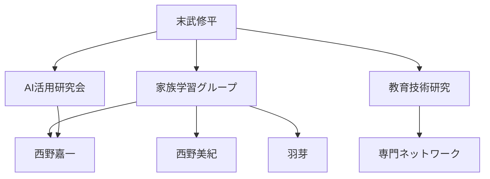

# 家族関係性マップ

## 🎯 マップ概要

**対象範囲**: 末武・西野拡大家族ネットワーク  
**作成目的**: 家族関係性の可視化と学習・協力機会の最適化  
**最終更新**: 2025-05-27

## 🔗 関係性構造

### 中心人物

**[[末武修平]]** - 家族技術プロジェクトリーダー、システム設計者

### 第 1 層（直接的関係）

#### 強い関係

- **[[西野美紀]]** - 母親

  - 関係の強度: ⭐⭐⭐⭐⭐
  - 交流頻度: 日常的
  - 主な交流内容: 家族運営、子育て協力、生活全般

- **[[羽芽]]** - 娘
  - 関係の強度: ⭐⭐⭐⭐⭐
  - 交流頻度: 日常的
  - 主な交流内容: 教育支援、学習指導、成長サポート

#### 中程度の関係

- **[[西野嘉一]]** - 義父（西野美紀の再婚相手）
  - 関係の強度: ⭐⭐⭐⭐
  - 交流頻度: 週数回
  - 主な交流内容: AI 教育プロジェクト協力、技術討議、家族活動

### 第 2 層（間接的関係）

#### 拡大家族ネットワーク

- **末武家親族** - 血縁関係 (via [[末武修平]])
- **西野家親族** - 姻戚関係 (via [[西野美紀]], [[西野嘉一]])

## 🌐 コミュニティ・ネットワーク

### 所属コミュニティ

#### [[Networks/Learning_Groups/家族学習グループ]]

- **メンバー**: [[末武修平]], [[西野嘉一]], [[西野美紀]], [[羽芽]]
- **役割**: プロジェクトリーダー（末武修平）
- **活動内容**: AI 活用学習システム実験、個人プロファイリング
- **関係性の特徴**: 実験的協力関係、相互学習支援

#### [[Networks/Interest_Communities/AI活用研究会]]

- **メンバー**: [[末武修平]], [[西野嘉一]]
- **役割**: 技術リーダー（末武修平）、実験協力者（西野嘉一）
- **活動内容**: AI 技術の実践的活用、効果検証
- **関係性の特徴**: 技術的協力関係、知識共有

### コミュニティ間の重複

## 📊 関係性分析

### 関係性の強度分布

| 強度レベル | 人数 | 割合 | 主な特徴                 |
| ---------- | ---- | ---- | ------------------------ |
| ⭐⭐⭐⭐⭐ | 2    | 50%  | 日常的交流、深い信頼関係 |
| ⭐⭐⭐⭐   | 1    | 25%  | 定期的交流、協力的関係   |
| ⭐⭐⭐     | 1    | 25%  | 間接的関係、潜在的協力   |

### 交流パターン

#### 高頻度交流（日常的）

- [[西野美紀]] - 家族運営、子育て協力
- [[羽芽]] - 教育支援、学習指導

#### 中頻度交流（週数回）

- [[西野嘉一]] - プロジェクト協力、技術討議

#### 低頻度交流（月 1 回未満）

- 拡大家族メンバー - 家族行事、特別な機会

## 🚀 ネットワーク活用の機会

### 協力・支援の可能性

#### 直接的協力

- **[[西野嘉一]] × [[羽芽]]**: 学習支援における論理的思考指導
- **[[西野美紀]] × [[羽芽]]**: 日常学習サポートと成長記録

#### 仲介・紹介の機会

- **AI 教育普及**: [[末武修平]] → [[西野嘉一]] → 外部コミュニティ
- **家族学習文化**: [[末武修平]] → [[西野美紀]] → 他の母親ネットワーク

### 知識・情報の流れ

#### 情報収集源

- **AI 技術**: [[末武修平]]の専門知識
- **実用性評価**: [[西野嘉一]]の論理的分析
- **学習者視点**: [[羽芽]]の実体験

#### 情報発信先

- **家族内**: 学習成果の共有、技術活用方法
- **外部コミュニティ**: 実験成果、ベストプラクティス

## 📈 関係性の変化・発展

### 最近の変化（過去 3 ヶ月）

#### 新しい関係

- **[[西野嘉一]]との協力関係**: AI 教育プロジェクトを通じた技術的協力の開始

#### 関係性の深化

- **[[西野嘉一]]**: 義父から協力的パートナーへの関係性発展
- **[[羽芽]]**: 学習者から実験協力者への役割拡大

#### 関係性の変化

- **家族全体**: 個別関係から協力的プロジェクトチームへの発展

### 今後の発展可能性

#### 関係強化の機会

- **[[西野嘉一]]**: 共同プロジェクトを通じた信頼関係の深化
- **[[羽芽]]**: 学習成果を通じた相互理解の向上

#### 新しい関係の可能性

- **拡大家族**: プロジェクト成果を通じた関係性拡大
- **外部ネットワーク**: 家族実験の成功による新しい協力関係

## 🔗 関連ファイル

### 個人プロファイル

- [末武修平プロファイル](../Profiles/Family/末武修平_プロファイル.md)
- [西野嘉一プロファイル](../Profiles/Family/西野嘉一_プロファイル.md)
- [西野美紀プロファイル](../Profiles/Family/西野美紀_プロファイル.md)
- [羽芽プロファイル](../Profiles/Family/羽芽_プロファイル.md)

### 他の関係性マップ

- [プロジェクト関係図](Project_Connections.md)
- [学習ネットワーク図](Learning_Network.md)

### コミュニティ情報

- [家族学習グループ](../Networks/Learning_Groups/家族学習グループ.md)
- [AI 活用研究会](../Networks/Interest_Communities/AI活用研究会.md)

## 📝 アクションプラン

### 短期アクション（1 ヶ月以内）

- [ ] 西野美紀、羽芽の詳細プロファイリング実施
- [ ] 家族内コミュニケーション頻度の最適化
- [ ] プロジェクト協力体制の明文化

### 中期アクション（3 ヶ月以内）

- [ ] 拡大家族への実験拡大可能性の検討
- [ ] 外部ネットワークとの連携機会の探索
- [ ] 関係性効果の定量的測定開始

### 長期ビジョン（6 ヶ月以上）

- [ ] 家族学習文化の完全確立
- [ ] 他家族への展開モデルの構築
- [ ] 社会的ネットワークへの貢献実現

## 🔄 更新履歴

| 日付       | 更新内容                                         | 更新者   |
| ---------- | ------------------------------------------------ | -------- |
| 2025-05-27 | 初回作成：家族関係性の基本構造とネットワーク分析 | 末武修平 |

---

**注記**: この関係性マップは 2025 年 5 月 27 日時点での情報に基づいて作成されています。人間関係は動的に変化するため、定期的な更新と見直しを行います。
