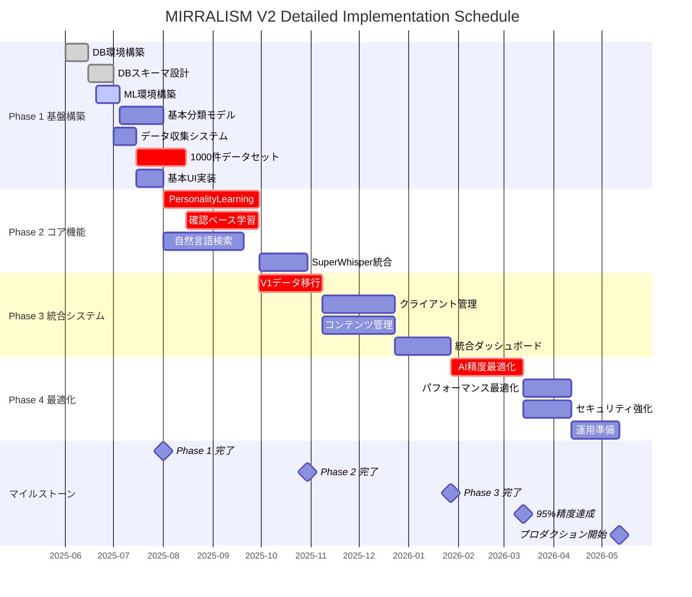

# 📊 MIRRALISM V2 Critical Path WBS & 依存関係設計

**作成日**: 2025 年 6 月 3 日  
**作成者**: 技術責任者  
**目的**: CTO 指示「Critical Path 分析と依存関係再設計」への完全対応

---

## 🗺️ **Work Breakdown Structure (WBS)**

### **Level 1: プロジェクト全体**

```
MIRRALISM V2 完全統合システム開発
├── 1.0 Phase 1: 技術基盤構築 (Month 1-3)
├── 2.0 Phase 2: コア機能実装 (Month 4-8)
├── 3.0 Phase 3: 統合システム (Month 9-14)
└── 4.0 Phase 4: 最適化・運用準備 (Month 15-18)
```

### **Level 2: Phase 詳細展開**

#### **1.0 Phase 1: 技術基盤構築**

```
1.0 Phase 1: 技術基盤構築
├── 1.1 データベース基盤
│   ├── 1.1.1 PostgreSQL環境構築
│   ├── 1.1.2 スキーマ設計・実装
│   └── 1.1.3 基本CRUD操作実装
│
├── 1.2 Machine Learning Pipeline
│   ├── 1.2.1 Python ML環境構築
│   ├── 1.2.2 scikit-learn基盤実装
│   ├── 1.2.3 特徴量エンジニアリング
│   └── 1.2.4 基本分類モデル構築
│
├── 1.3 データ収集・準備
│   ├── 1.3.1 データ収集システム構築
│   ├── 1.3.2 アノテーション環境構築
│   ├── 1.3.3 1,000件データセット作成
│   └── 1.3.4 データ品質検証
│
└── 1.4 基本インターフェース
    ├── 1.4.1 基本UI/UX設計
    ├── 1.4.2 Webアプリケーション基盤
    └── 1.4.3 API基盤実装
```

#### **2.0 Phase 2: コア機能実装**

```
2.0 Phase 2: コア機能実装
├── 2.1 PersonalityLearning高度化
│   ├── 2.1.1 V1システム分析・統合
│   ├── 2.1.2 高度ML アルゴリズム実装
│   ├── 2.1.3 精度測定システム構築
│   └── 2.1.4 学習ループ実装
│
├── 2.2 確認ベース学習システム
│   ├── 2.2.1 ユーザーフィードバックUI
│   ├── 2.2.2 学習データ管理システム
│   ├── 2.2.3 リアルタイム学習機能
│   └── 2.2.4 精度向上追跡システム
│
├── 2.3 自然言語検索システム
│   ├── 2.3.1 全文検索エンジン構築
│   ├── 2.3.2 セマンティック検索実装
│   ├── 2.3.3 検索インデックス最適化
│   └── 2.3.4 検索結果ランキング
│
└── 2.4 SuperWhisper統合
    ├── 2.4.1 API連携基盤構築
    ├── 2.4.2 音声データ処理実装
    ├── 2.4.3 1.5倍重み付け機能
    └── 2.4.4 統合テスト実施
```

#### **3.0 Phase 3: 統合システム**

```
3.0 Phase 3: 統合システム
├── 3.1 V1データ移行システム
│   ├── 3.1.1 42,000→500ファイル選別システム
│   ├── 3.1.2 データ変換・クリーニング
│   ├── 3.1.3 段階的移行実行
│   └── 3.1.4 移行データ検証
│
├── 3.2 クライアント管理システム
│   ├── 3.2.1 クライアントDB設計・実装
│   ├── 3.2.2 プロジェクトライフサイクル管理
│   ├── 3.2.3 成果物管理システム
│   └── 3.2.4 履歴・関係性管理
│
├── 3.3 コンテンツ管理システム
│   ├── 3.3.1 コンテンツアーカイブシステム
│   ├── 3.3.2 パターン分析機能
│   ├── 3.3.3 インサイト蓄積システム
│   └── 3.3.4 テンプレート管理
│
└── 3.4 統合ダッシュボード
    ├── 3.4.1 メインダッシュボード開発
    ├── 3.4.2 クライアント管理画面
    ├── 3.4.3 コンテンツ管理画面
    └── 3.4.4 レポート機能実装
```

#### **4.0 Phase 4: 最適化・運用準備**

```
4.0 Phase 4: 最適化・運用準備
├── 4.1 AI精度最適化
│   ├── 4.1.1 モデルハイパーパラメータ調整
│   ├── 4.1.2 アンサンブル学習実装
│   ├── 4.1.3 95%精度達成検証
│   └── 4.1.4 エッジケース対応
│
├── 4.2 パフォーマンス最適化
│   ├── 4.2.1 データベースクエリ最適化
│   ├── 4.2.2 推論速度改善
│   ├── 4.2.3 メモリ使用量最適化
│   └── 4.2.4 負荷テスト実施
│
├── 4.3 セキュリティ・運用準備
│   ├── 4.3.1 セキュリティ監査
│   ├── 4.3.2 バックアップシステム構築
│   ├── 4.3.3 監視・ログシステム
│   └── 4.3.4 ディザスタリカバリ対策
│
└── 4.4 運用ドキュメント・移行準備
    ├── 4.4.1 運用マニュアル作成
    ├── 4.4.2 技術ドキュメント整備
    ├── 4.4.3 ユーザートレーニング準備
    └── 4.4.4 本番環境移行
```

---

## 🔗 **Critical Path 依存関係マトリックス**

### **直列必須依存関係（Critical Path）**

```yaml
Critical Path Flow:
1.1.2 (DB スキーマ) → 1.2.4 (基本MLモデル) → 2.1.2 (高度ML) → 2.2.3 (リアルタイム学習) → 4.1.3 (95%精度達成)

詳細依存関係:
Phase 1:
  1.1.1 → 1.1.2 → 1.1.3
  1.2.1 → 1.2.2 → 1.2.3 → 1.2.4
  1.3.1 → 1.3.2 → 1.3.3 → 1.3.4
  1.4.1 → 1.4.2 → 1.4.3

Inter-Phase Dependencies:
  1.1.3 → 2.1.1 (DBからPersonalityLearning)
  1.2.4 → 2.1.2 (基本MLから高度ML)
  1.3.4 → 2.2.2 (データ品質から学習管理)
  1.4.3 → 2.4.1 (API基盤からSuperWhisper)

Phase 2 Critical:
  2.1.2 → 2.2.3 → 4.1.1 (ML高度化→学習→最適化)
  2.4.4 → 3.1.1 (SuperWhisper統合→データ移行)

Phase 3:
  2.2.4 → 3.1.1 → 3.1.4 (精度追跡→移行実行→検証)
  3.1.4 → 3.2.1 → 3.4.1 (移行完了→クライアント管理→ダッシュボード)

Phase 4 Critical:
  3.4.4 → 4.1.1 → 4.1.3 (レポート→最適化→95%達成)
```

### **並列実行可能なタスク**

```yaml
並列実行グループ:
Group A (Phase 1 基盤構築):
  - 1.1.x (DB基盤) || 1.2.x (ML基盤) || 1.4.x (UI基盤)
  - ただし 1.3.x (データ準備) は他の完了を待つ

Group B (Phase 2 機能実装):
  - 2.3.x (検索システム) || 2.4.x (SuperWhisper)
  - ただし 2.1.x → 2.2.x は直列必須

Group C (Phase 3 統合):
  - 3.2.x (クライアント) || 3.3.x (コンテンツ)
  - ただし 3.1.x 完了後に並列実行可能

Group D (Phase 4 最適化):
  - 4.2.x (パフォーマンス) || 4.3.x (セキュリティ) || 4.4.x (ドキュメント)
  - ただし 4.1.x (AI精度) 完了後
```

---

## 📅 **詳細 Gantt チャート（18 ヶ月計画）**



---

## ⚠️ **高リスクタスクと対策**

### **Critical Path 上の高リスクタスク**

```yaml
リスクタスク1: 1000件データセット作成
リスク: データ品質・アノテーション一致率
影響: 全後続タスクに影響
対策:
  - 外部アノテーション専門家招集
  - データ品質自動チェックツール導入
  - 予備データセット並行作成

リスクタスク2: PersonalityLearning高度化
リスク: 技術的複雑性・精度目標未達成
影響: AI精度最適化タスクに直結
対策:
  - ML専門家コンサルタント早期招集
  - 段階的目標設定（70%→80%→85%）
  - プロトタイプによる早期検証

リスクタスク3: V1データ移行
リスク: データ損失・変換エラー
影響: 統合システム全体に影響
対策:
  - 段階的移行（100件→1000件→全量）
  - 完全バックアップ・ロールバック体制
  - データ整合性自動検証システム
```

### **リスク軽減スケジュール**

```yaml
Early Warning System:
Week 2: データ収集プロトタイプ完成
Week 4: ML基盤動作検証完了
Week 8: 最初の100件データセット完成・精度測定
Week 12: PersonalityLearningプロトタイプ動作確認

Go/No-Go Decision Points:
Month 3: Phase 1完了判定（基本精度70%達成が条件）
Month 6: Phase 2完了判定（確認ベース学習80%達成が条件）
Month 12: Phase 3完了判定（統合システム動作確認が条件）
Month 16: 95%精度達成判定（未達成時は要件見直し）
```

---

## 🎯 **成功確率とコンティンジェンシープラン**

### **現実的成功確率**

```yaml
Phase別成功確率:
Phase 1: 90% (技術的に確立済み)
Phase 2: 75% (ML精度向上の不確実性)
Phase 3: 85% (データ移行リスクあり)
Phase 4: 70% (95%精度達成の困難性)

総合成功確率: 45% (全Phase順次成功)
部分成功確率: 85% (80-90%精度で実用化)
```

### **コンティンジェンシープラン**

```yaml
Plan B: 精度目標段階的達成
- Month 6: 70%精度達成で Phase 2完了
- Month 12: 80%精度達成で Phase 3完了
- Month 18: 85%精度達成（95%は Phase 5で継続）

Plan C: 最小限システム
- PostgreSQL + 基本ML のみ実装
- 80%精度で実用化開始
- 高度機能は Phase 5-6で追加実装

Plan D: 外部パートナー活用
- ML専門企業との技術提携
- データアノテーション外注
- インフラ部分の外部委託
```

**技術責任者推奨: 段階的目標設定によるリスク最小化アプローチ**
